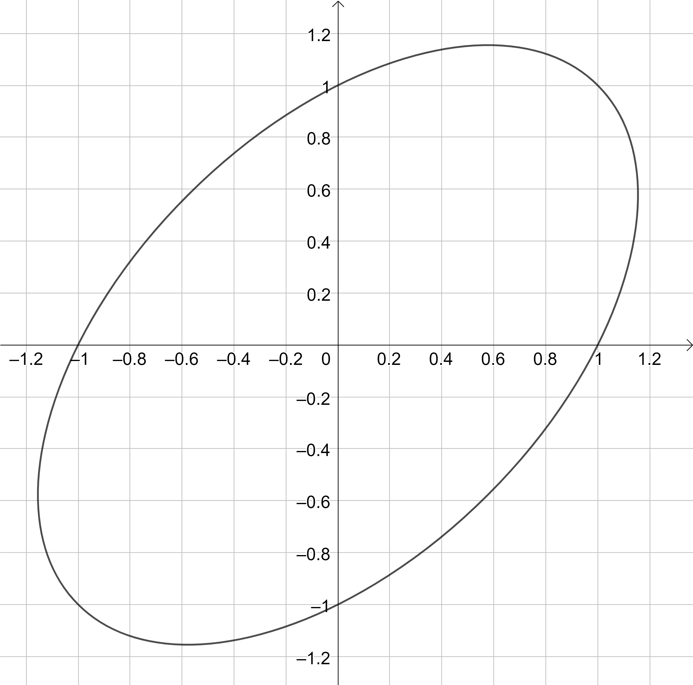

# Triples
## Introduction
This small programm defines functions to calculate pythagorian triples and trojan triples to a given natural number. Pythagorean triples are natural numbers, which satisfy the equation a2 + b2 = c2.  
Trojan triples (myexpression) are natural numbers, which satisfy the equation a2 + b2 - a*b = c2 or the equation a2 + b2 + a*b = c2. If the edges of a triangle are a pythagorean triple there is one 90°-angle. If the edges of a triangle are a trojan triple there is one 60°-angle or one 120°-angle.  
These functions are used either to help teachers finding beautiful exercises for their students ore to investigate such triangles.

## Some results
The following results are not proven as far as I know. Therfore they are conjectures.
- Prime numbers >2 are part of one or two pythagorean triples.
- The sum of triples of twin primes is exactly 3. For the twin primes 3 and 5 the triple (3, 4, 5) is counted once for 3 and once for 5.
- Every natural number >2 is part at least of one pythagoren triple.
- Every natural number >2 exept 4 is part at least of one trojan triple.
## Theoretical background
The unit circle x2 + y2 = 1 consists of rational and irrational points. If a line through the point (-1,0) is intersected with the unit circle, the second intersection point will have rational coordinates. These coordinates correspond to a pythagorean triple as follows. The denominator of the fraction is c. The numeraters are a and b.   
The trojan triples are calculated the same way except the line is intersected with the unit ellipse (again my expression) x2 + y2 - xy = 1 (see figure and [geogebra investigations]https://www.geogebra.org/classic/qeqhvfsw)).

## About my expressions
### Trojan Triples
Though some mathematicians call the trojan triples antipythagorean triples, I don't use that term, because that expression is missleading. The prefix "anti" indicates that somthing is the opposite of another. The angles 60° and 120° look more like the trojans of a planet, which share the orbit with the planet, but leading or trailing about 60° in relation to the planet. The trojan triples are 30° ahead ore 30° behind the dominant 90°-angle.
### Unit Ellipse
I call x2 + y2 - xy = 1 unit ellipse, because like the unit circle it is a conic section and its equation has no factors. Therfore this ellipse has 6 integer points: (1,1), (1,0), (0,1), (0,-1), (-1,0) and (-1,-1). Like the unit circle it is symmetrical to the median. There are more nice properties of this ellipse which make it to the role model of all ellipses.
